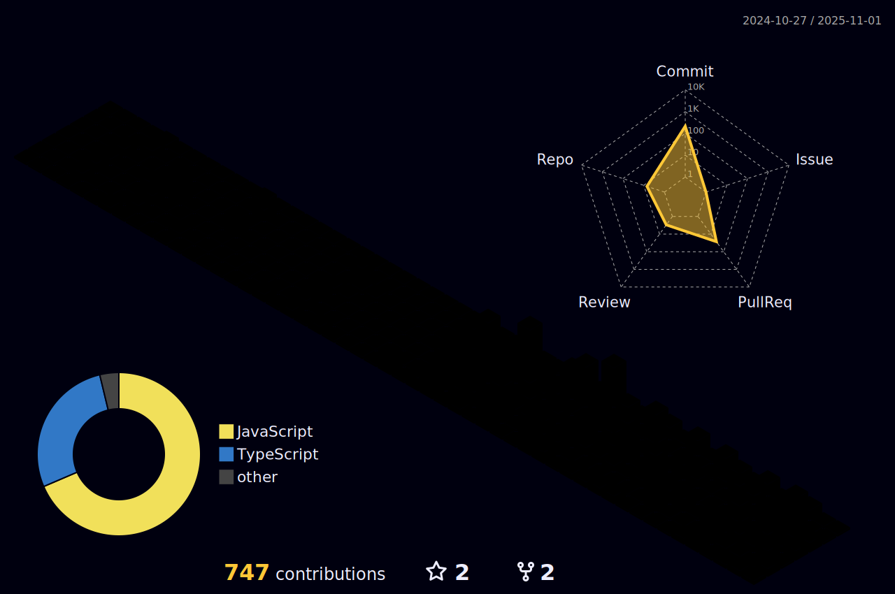

<h1 align="center">Hi 👋, I'm Jigyasu</h1>
<h3 align="center">A Passionate Full Stack Developer from India</h3>

---
### 📊 GitHub Summary Cards

  

  
  

### 💻 My Development Toolkit
<table align="center">
  <tr>
    <td><strong>Programming Languages</strong></td>
    <td>
      
    </td>
  </tr>

  <tr>
    <td><strong>Frontend Development</strong></td>
    <td>
      
    </td>
  </tr>

  <tr>
    <td><strong>Backend & Database</strong></td>
    <td>
      
    </td>
  </tr>

  <tr>
    <td><strong>Developer Tools</strong></td>
    <td>
      
    </td>
  </tr>

  <tr>
    <td><strong>Cloud & Platforms</strong></td>
    <td>
      
    </td>
  </tr>

  <tr>
    <td><strong>Libraries & Frameworks</strong></td>
    <td>
      
    </td>
  </tr>
</table>

## GitHub Contribution Summary

